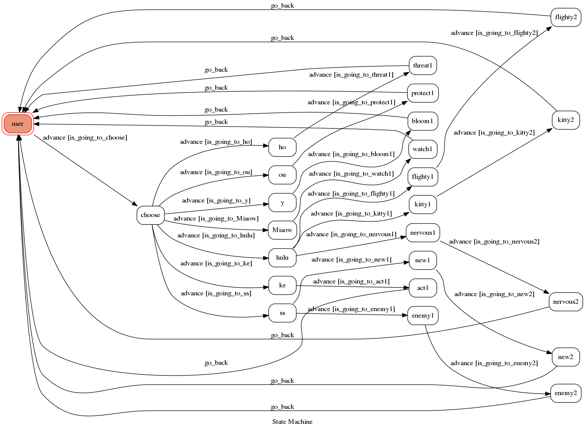

# What-the-cats-say

Template Code for TOC Project 2019
A LINE bot based on a finite state machine

 ### Prerequisite
* Python 3
* HTTPS Server

## Finite State Machine

## Usage

The initial state is set to `user`.

* user

	* Input: "start"
      * 進入`choose`開始輸入貓叫聲
      
* choose

	* Input: "呼嚕呼嚕"
      * Reply: "是幼貓?成貓撒嬌?緊張不舒服?"
          * 之後輸入三者之一
     
  * Input: "呼嚕呼嚕"
      * Reply: "是幼貓?成貓撒嬌?緊張不舒服?"
      
